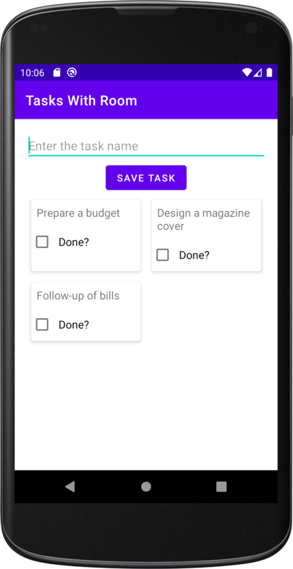
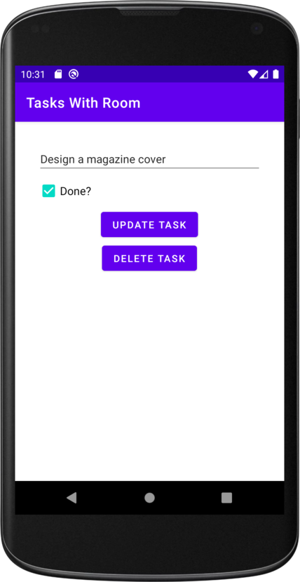
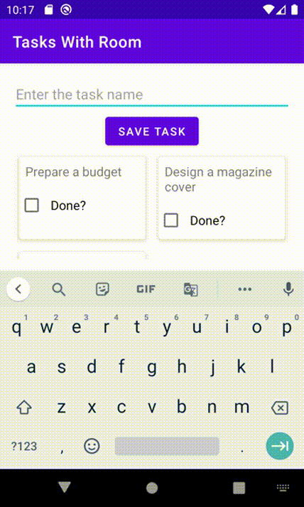
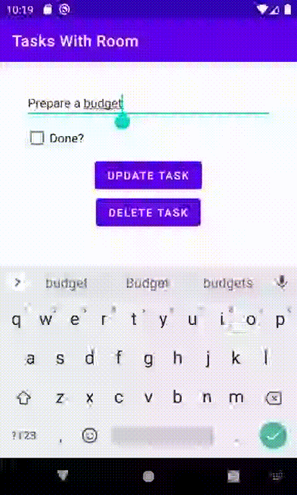

# Tasks With Room 📅

Apps can persist data using a database
In most cases, the best way of persisting the user's data is to use a database, so in this app, you can see how to use one by building a Tasks app. This app will let the user add tasks to a database, and display a list of all the tasks they have already entered.

|  |  |
| ------ | ------ |

## App Structure

The app will contain a single activity (MainActivity), which will be used to display a fragment named TasksFragment.

TasksFragment is the app's main screen. Its layout file (fragment tasks.xml) will include an edit text and a button, which let the user enter a task name and insert it into the database. It will also feature a text view, which will display all of the tasks that have been entered into the database

I did add a view model (named TasksViewModel) to the app, which Tasks Fragment will use for its business logic. It will include properties and methods that the fragment will use to interact with the app's database. App enables data binding so that Tasks Fragment's layout has direct access to the view model.

| New Task | Update Task | Delete Task |
| ------ | ------ | ------ |
|  |  | 
